# Asiedu Minta Kwaku

**Software Developer · Embedded Systems Engineer · IoT Developer**

I build software and connected systems that bring hardware, local applications, and cloud services together. Based in Ghana, I work across embedded devices, offline-capable business software, and web and mobile applications.

[Portfolio](https://asiedudevhub.auralenx.com) · [LinkedIn](https://www.linkedin.com/in/kwaku-minta-asiedu-52597234a) · [Email](mailto:asiedudev.hub@gmail.com)

## What I build

- **Business software:** [Novend POS](https://novendpos.app), an offline-first point-of-sale platform for retail and multi-branch operations.
- **Connected devices:** ESP32 and Arduino prototypes, sensor integration, monitoring, and automation.
- **Full-stack applications:** responsive interfaces, APIs, authentication, data dashboards, and synchronization.

## Tools I use

- **Languages:** TypeScript, JavaScript, Python, C, C++
- **Applications:** React, Next.js, Node.js, Electron, Capacitor
- **Data and cloud:** PostgreSQL, Supabase, Firebase, Convex, SQLite, IndexedDB
- **Hardware:** ESP32, Arduino, Raspberry Pi

## GitHub analytics

 

 

The cards measure different things: repository stats and language sizes are not the same as the contribution count on GitHub's profile calendar. The repository statistics, language and streak cards refresh weekly. The activity card comes from a live service and can be cached for several hours.

## Connect

[LinkedIn](https://www.linkedin.com/in/kwaku-minta-asiedu-52597234a) · [Portfolio](https://asiedudevhub.auralenx.com) · [Email](mailto:asiedudev.hub@gmail.com) · [GitHub repositories](https://github.com/AsieduDevelopmentHub?tab=repositories)
