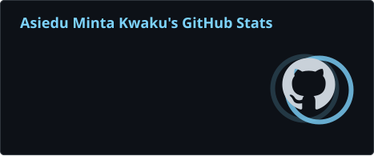
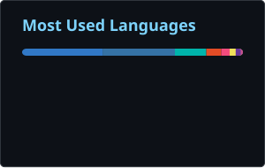

# Asiedu Minta Kwaku

### Software Developer · IoT & Embedded Systems Engineer
**Co-founder & CTO at [Vital-Go](https://vital-go.com)**

I build software and connected devices that solve practical business and engineering problems—from offline-first applications to embedded firmware and hardware-to-cloud integration.

Based in **Ghana**, open to working with clients and teams globally.

[Portfolio](https://asiedudevhub.auralenx.com/) · [LinkedIn](https://www.linkedin.com/in/asiedudevelopmenthub) · [YouTube](https://www.youtube.com/@asiedudevelopmenthub) · [Email](mailto:asiedudev.hub@gmail.com)

---

## How I can help

- **Software development:** web applications, business tools, dashboards, APIs, and cross-platform applications.
- **Offline-first systems:** local data storage, synchronization, and workflows for unreliable connectivity.
- **IoT and embedded systems:** ESP32 firmware, sensor integration, device communication, and telemetry.
- **Systems integration:** connecting hardware, backend services, databases, and user-facing applications.

My work spans business software, connected health, and electrical and industrial monitoring. You can also find my systems-design work at [KofKaN Technologies](https://www.kofkantechnologies.com/team/asiedu-minta-kwaku).

## Selected work

### [Novend POS](https://novendpos.app)
**Offline-first business software**

I develop Novend POS for retail and multi-branch businesses, working across web, desktop, and mobile. My work covers local data storage, synchronization, inventory, sales workflows, and hardware integration.

### [DSE Modbus Gateway](https://github.com/AsieduDevelopmentHub/dse-modbus-gateway)
**Embedded firmware · Industrial communication**

An ESP32-C3 and MAX485 project for communicating with DSE generator controllers over Modbus RTU/RS485. The repository includes wiring guidance, build instructions, diagnostics documentation, and a serial CLI reference.

### [Vital-Go](https://vital-go.com)
**Co-founder & CTO · Connected health**

I guide the technical direction of Vital-Go, a health monitoring platform in active development. Our work connects software, wearable data, device integration, and patient and clinician experiences.

### [TankGuard](https://github.com/AsieduDevelopmentHub/tankguard-esp32)
**Embedded control · Bench prototype**

An ESP32-C3 water-tank controller prototype exploring level sensing, control logic, and fault handling. The current starter keeps physical relay output disabled; it is a development project, not a deployed pump-control product.

### [CyberSafe](https://github.com/AsieduDevelopmentHub/CyberSafe)
**Cybersecurity education**

A cybersecurity awareness application covering topics such as phishing, password security, social engineering, and data protection.

---

## Technologies

  <strong>Languages</strong>  
  

  <strong>Applications</strong>  
  

  <strong>Data and development</strong>  
  

  <strong>Hardware</strong>  
  

Also working with ESP32, Convex, IndexedDB, and Capacitor.

---

## GitHub activity

  
  &nbsp;&nbsp;&nbsp;
  

  

  

Repository stats and language cards update weekly. The streak and activity cards update through their providers and may be cached for several hours. Contribution totals and repository stats measure different activity.

---

## Work with me

Available to discuss software projects, IoT prototypes, embedded development, technical partnerships, and relevant engineering opportunities.

Tell me what you are building, the problem you need to solve, and your expected timeline.

**Email:** [asiedudev.hub@gmail.com](mailto:asiedudev.hub@gmail.com)  
**Phone / WhatsApp:** [+233 55 525 7482](https://wa.me/233555257482)

[Portfolio](https://asiedudevhub.auralenx.com/) · [LinkedIn](https://www.linkedin.com/in/asiedudevelopmenthub) · [YouTube](https://www.youtube.com/@asiedudevelopmenthub)
